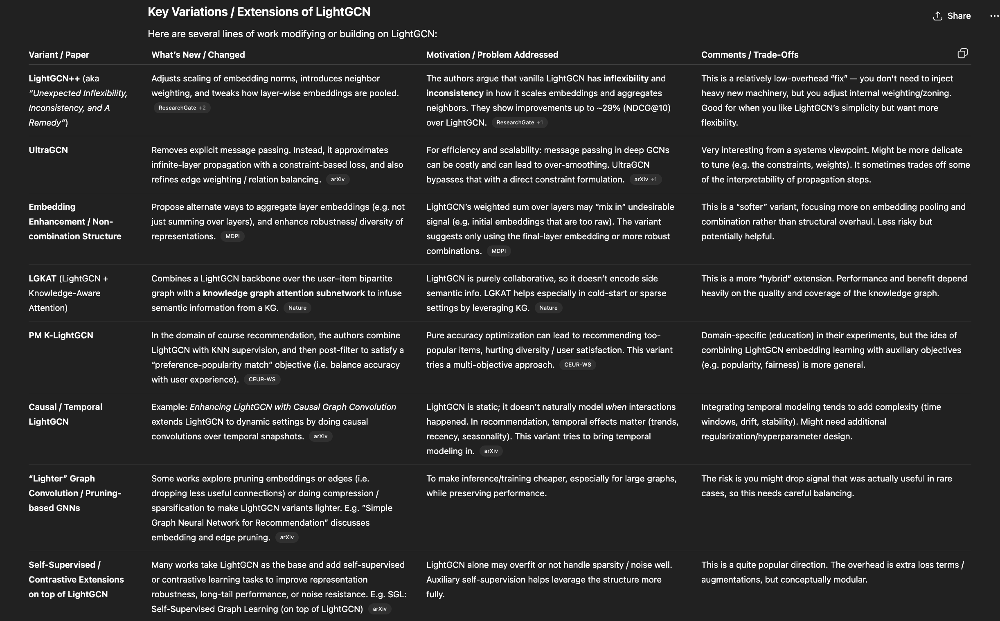

# GCN_Recommendation

# Idea 

Recommendation System

1) Get data
2) Build a minimal working prototype from the data (build from scratch first (toy example)) and then scale with libraries 
3) Try out various new methods - (1. GEE 2. how LightGCN is better? where does GCN perform better than LGCN? what methods to come to make these even better? )
4) Abalation study
5) Publishable paper

To Do:

we have:
 # user id 
 # item id 
 # combination id 

 now implement the LightGCN paper.

 https://medium.com/@xiaolancara/explanation-and-practice-of-lightweight-graph-convolutional-network-lightgcn-ac30ac38469c

 http://dmlab.kaist.ac.kr/~kijungs/papers/lightgcnppRecSys2024.pdf
 https://arxiv.org/pdf/2503.14213

 

